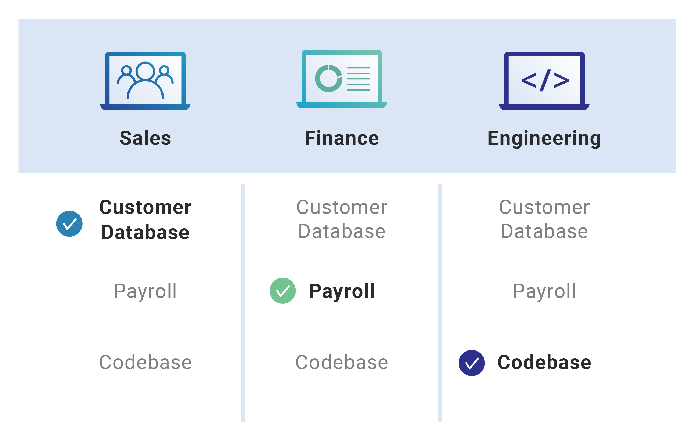
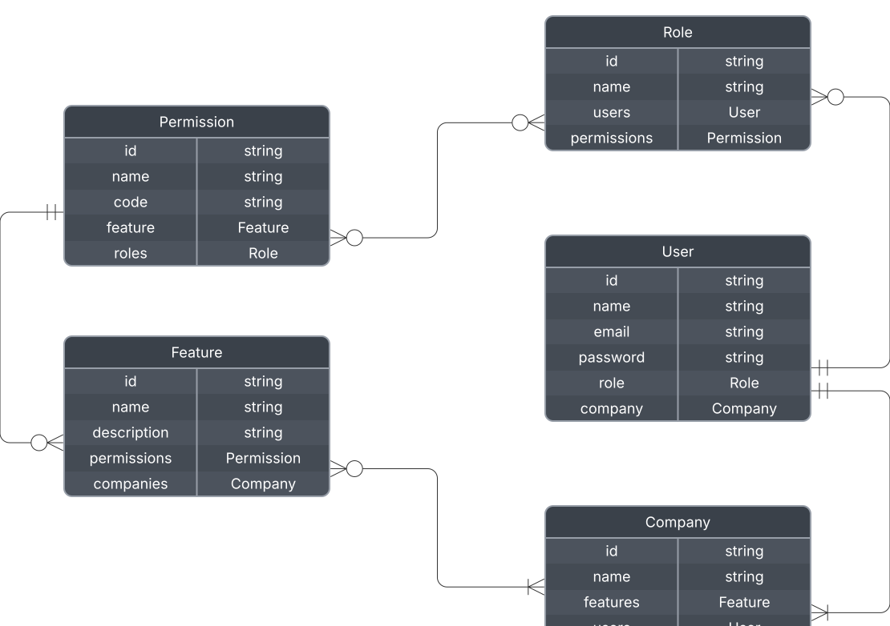
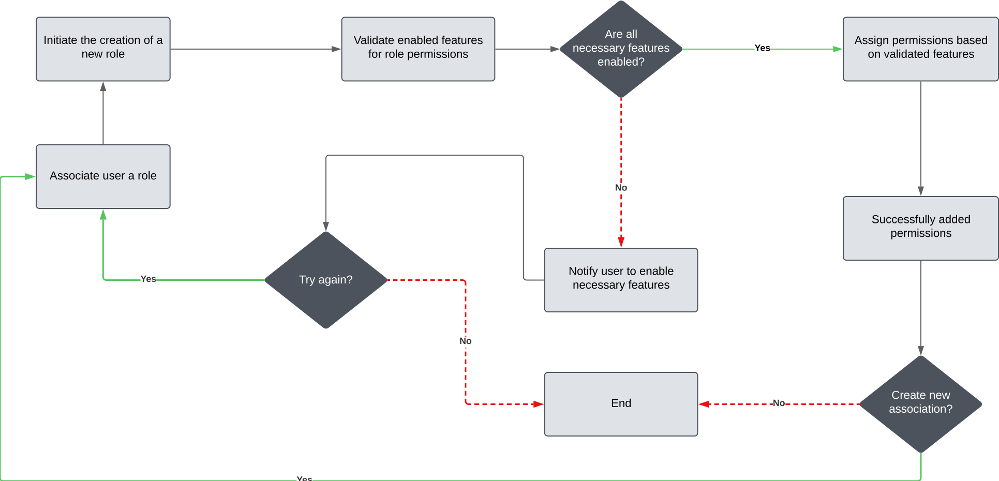
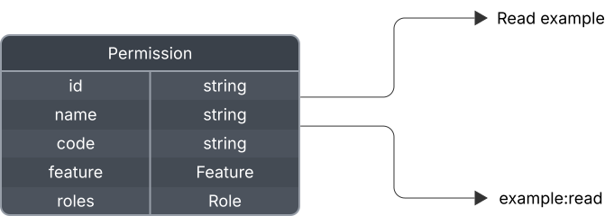
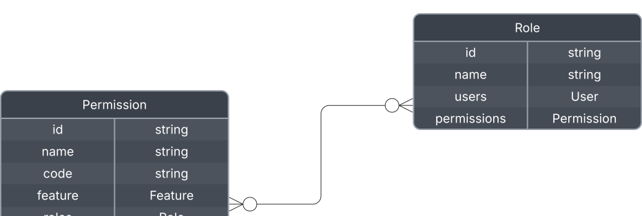
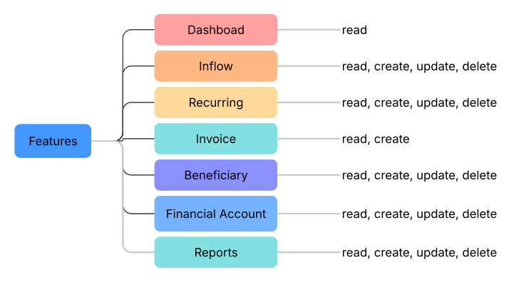
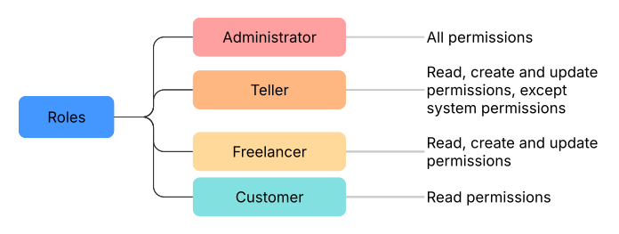

# Permissions Development

Just like any other SaaS, it was necessary to create a permissions base that relates to features and is included within a role. This way, we can use the same standard for all clients while leaving the customization control to them.

## RBAC (role-based access control)

Role-based access control (RBAC) is a method for controlling what users are able to do within a company's IT systems. RBAC accomplishes this by assigning one or more "roles" to each user, and giving each role different permissions. RBAC can be applied for a single software application or across multiple applications

_For more details, refer to [this article.](https://www.cloudflare.com/learning/access-management/role-based-access-control-rbac/)_

## Roles and Permissions

To build the "Contecon" system, it was necessary to work with a "features" architecture that will be linked to permissions that will be linked to roles (using RBAC). All permissions must be linked to a feature, which must be mandatorily related to a company.

**RBAC ER Diagram:**

### Features

The system features will mostly follow the route pattern, meaning each feature will have a dedicated route, except in cases where the feature fits within a microservice or a larger service.

### Permissions

Permissions follow a standard within the schema, the "code" of the permission follows a standard structure, with the name (or sliced name) of the feature and function permission.

### Roles

Roles will be nothing more than a set of multiple permissions, having a 0:M relationship, meaning that roles can exist without permissions for organizational purposes.

## Predefined Features and Permissions

For this system, some values have been developed that will be predefined, meaning they cannot be changed within the codebase. This model will be generated through a seed in the database, and any modifications must be made after deployment to the client.

## Predefined Roles

To optimize the initial use of the system, default roles have been created to facilitate usage.

